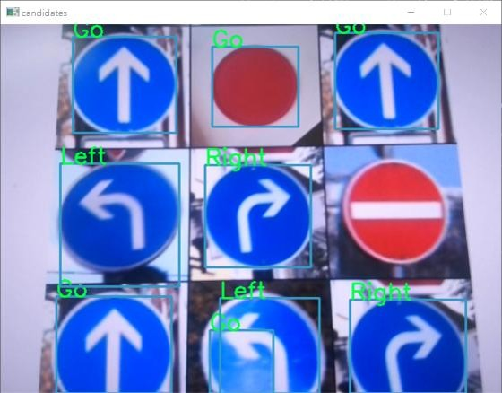
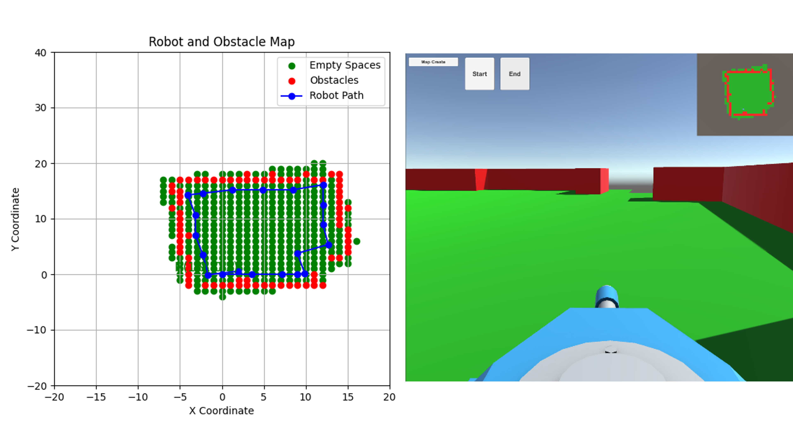

# DigitalTwin
1. Remote Control : Unity VR
2. Remote Control : Hand Pose
3. Virtual Envrionment : Robomaster, SLAM
4. Virtual Remote Control
5. New

## 1. Remote Control / Unity VR
Device : Mirobot, Turtlebot, Robomaster(추후)

**Mirobot, Turtlebot**


---

## 2. Remote Control / Hand Control

손의 모양, 블럭의 위치 등에 따른 자동차 동작

<p align="center">
  
  
  
</p>


---

## 3. Virtual Environment / Create Map

### Setting
, 


### Result


## 5. New
### Raspberry Pi 4 Remote Control from Windows

This guide explains how to set up **xrdp** on Raspberry Pi 4 to allow remote desktop access from Windows.  

---

#### 1. Raspberry Pi Setup

1. Install **xrdp** on your Raspberry Pi:

```bash
sudo apt-get update##
sudo apt-get install -y xrdp
```

#### 2. Window Setup

1. Open Remote Desktop Connection
2. If Black Screen Issue
(raspberry pi)

```bash
sudo vi /etc/xrdp/startwm.sh


unset DBUS_SESSION_BUS_ADDRESS
unset XDG_RUNTIME_DIR

test -x /etc/X11/Xsession && exec /etc/X11/Xsession
exec /bin/sh /etc/X11/Xsession

:wq
```