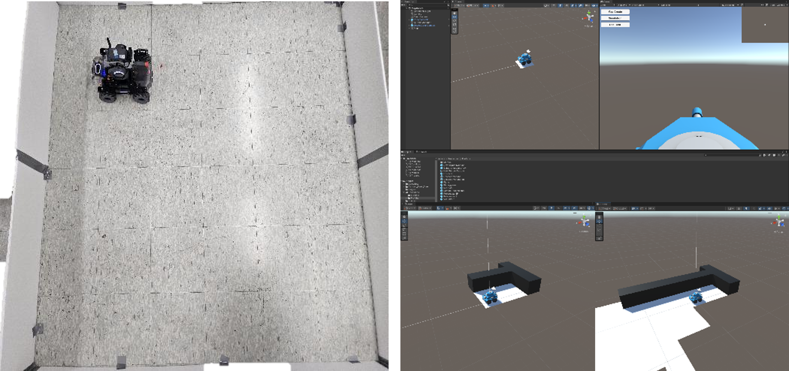
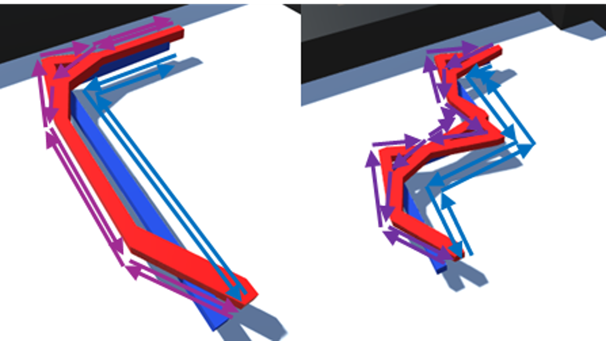

# Real2Sim, Sim2Real
**1. Remote Control : Unity VR**  
**2. Remote Control : Hand Pose**  
**3. Virtual Envrionment : Robomaster, SLAM**  
**4. Virtual Remote Control**  

## Remote Control / Unity VR
Device : Mirobot, Turtlebot, Robomaster(추후)

**Mirobot, Turtlebot**

---

## Remote Control / Hand Control

손의 모양, 블럭의 위치 등에 따른 자동차 동작

  
  
  

---

## Virtual Environment / Create Map

### Setting
, 

### Result

## Virtual Remote Control(by Simulation)

