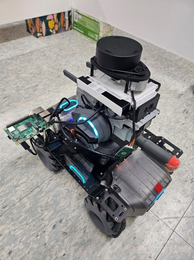

# Real2Sim, Sim2Real
**Control Real Device**
- Remote Control : Unity VR  
- Remote Control : Hand Pose  
- Virtual Remote Control  

**Create Virtual Environment**
- Virtual Environment : Robomaster, SLAM  
- Virtual Environment : Robomaster with Raspberry Pi 4, SLAM (Graph SLAM, [참고 GitHub 링크](https://github.com/HobbySingh/Graph-SLAM/tree/main/2d_lidar_slam))

## Remote Control / Unity VR
Device : Mirobot, Turtlebot, Robomaster(추후)

**Mirobot, Turtlebot**

  

  

---

## Remote Control / Hand Control

손의 모양, 블럭의 위치 등에 따른 자동차 동작

  
  
  

---
## Virtual Remote Control(by Simulation)

  

---

## Virtual Environment / Create Map

### Setting

  
  

### Result

  

---

## Virtual Environment / Extended Version

### Setting
#### Device : Robomaster EP + Raspberry pi 4

  

#### Virtual Envrionment

  
  
  

#### Real Envrionment

  
  

### Result
#### Virtual to Virtual

  
  
  

#### Real to Virtual

  
  

