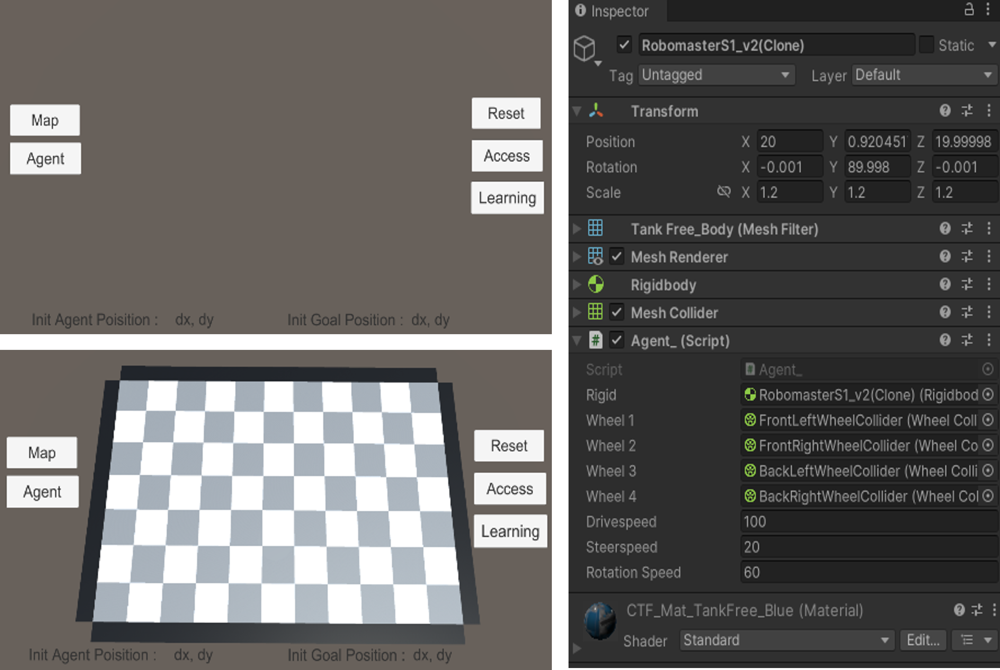
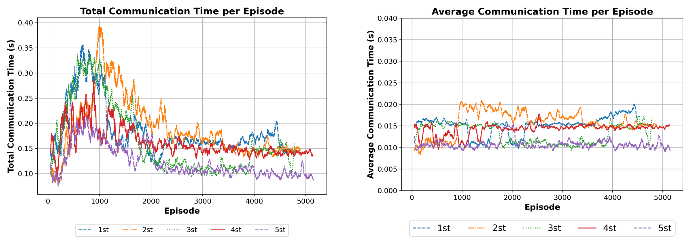

# Reinforcement
**1. Reinforcement, Python**  
**2. Reinforcement, Python, Unity**  
**3. Reinforcement, ROS**

## 1. RL(Python)

---

## 2. RL(Unity, Python)

### Unity Environment
Setting

Process

### Result
