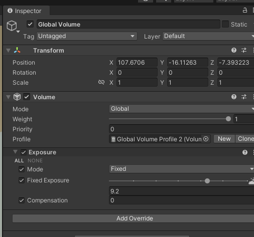

# MainWork / Unity Usage / UI

## Pink Mateiral
---
1. Package Manager  / Install HDRP
2. Window / Rendering / HDRP Wizard / fix all, Convert All ~ Material
---

## Light(Spot) & Global Volume
---
shape는 Box 형태가 가장 사용하기 편함.

setting - Global Volume : HDRP 모드에서 전체적인 밝기 조정시(화면이 매우 어두워서 조절하는 기능능)

---
